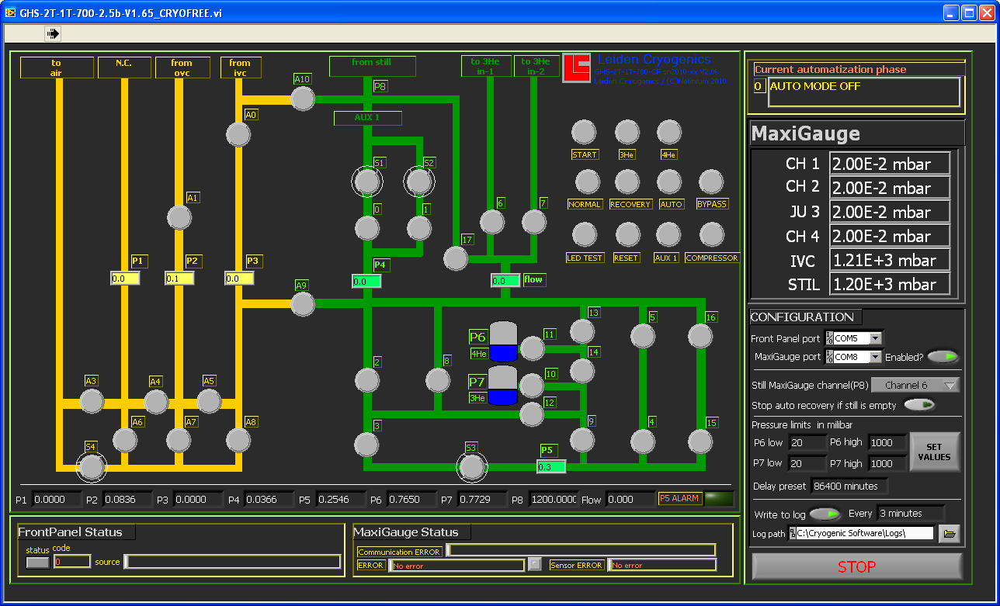
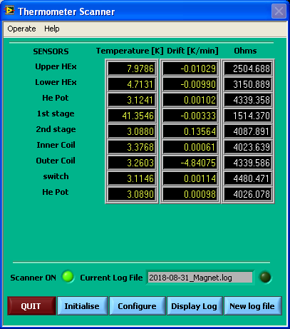
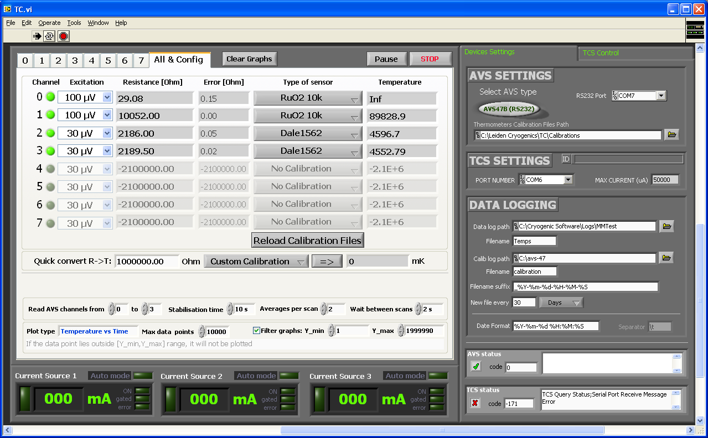
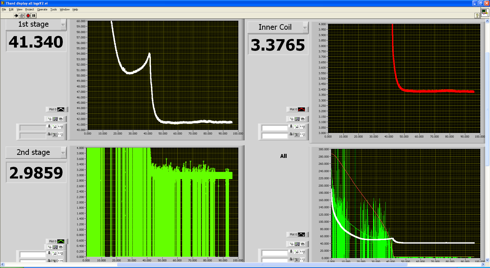

# Data acquisition

The magnet cryostat and the dilution refrigerator are connected to a PC running LabView (7.1?) on Windows XP.
In Labview, a number of scripts are available for controlling the dilution refrigerator and reading off values from the DR and magnet systems.

Later, I will make a system to control the DR, the magnet and a lock-in amplifier, to be able to make measurements controlled solely by the PC.

