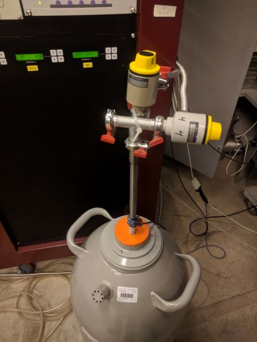

# Dilution refrigerator

The dilfridge in the lab is an _MCK50-100_ from _Leiden Cryogenics_.

## Control from PC

On the *LeidenDR* PC (see [Computers in the lab](LabComputers.md)) is a Labview VI that duplicates the front panel of the DR (though with a few differences to the real version).

## Cold trap

Between valves *4* and *5* is mounted a cold trap for condensing out impurities from the helium system.
The trap is cooled in liquid nitrogen, and gas is lead through it.
Oxygen and nitrogen will then condense and be absorbed by the trap, cleaning the helium.

The valves are mounted inside the cabinet, and flexible tubes lead to the trap, which is placed next to the cabinet.
At the trap, extra valves are mounted, also labelled *4* and *5* ensuring that the connection to the trap may be closed properly, even if there is a slight leak in the cabinet-mounted *4* and *5*.

The trap is placed in a dewar, which should be kept with liquid nitrogen, ensuring that the trap is always covered in nitrogen.

### Cleaning all helium

Because of the lay-out of the DR piping, the helium cannot be cleaned by pumping it from the dumps, through the trap, and directly back into the dumps.