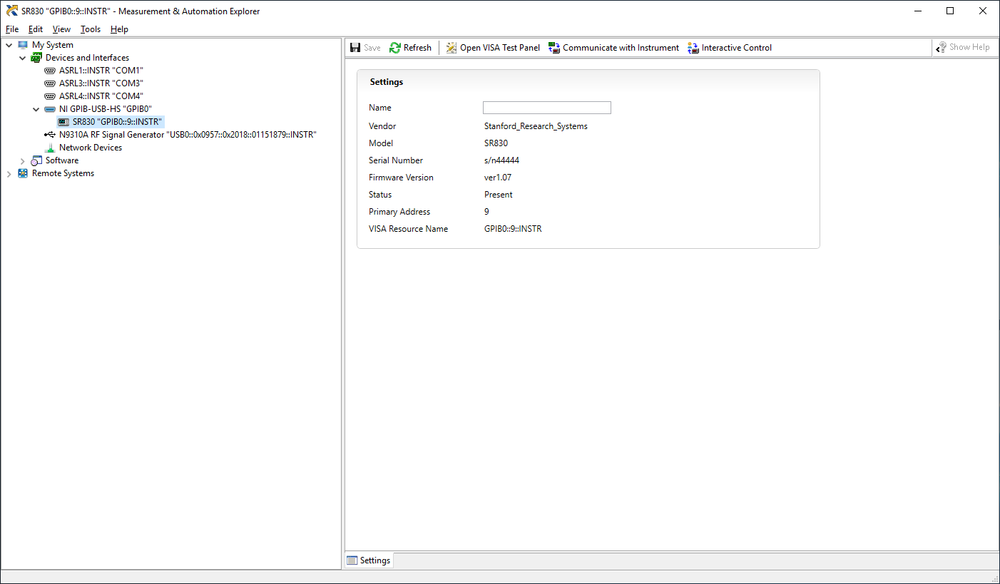

# Computers in the lab

## Susceptometry

A Windows 10 PC delivered in November '18.
Set up with a local administrator account.
I have set up a purely local account for the measurements, and people working in the lab can have personal (Microsoft and UCPH connected) accounts.

LabVIEW 2018 is installed along with NI-Visa, and the N9310A signal generator and the SR830 lock-in are connected and controllable from LabVIEW (the lock-in is connected through an NI GPIB-USB-HS controller).


## LeidenDR

A Windows XP machine connected to the magnet cryostat and the DR fridge monitoring system.

## magnetlab

In the lab is also the ```magnetlab``` PC which runs Ubuntu 18.04.1 LTS.
This machine I use to generate plots of the data from the ```LeidenDR``` and for different work that is not essential to the measurements, such as office or admin work.
Has a personal user account for myself.
I plan on making accounts for other users or specific tasks as the need arises.