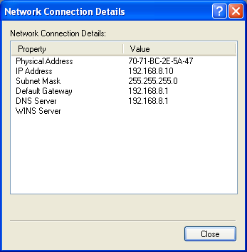

# Network setup

The computer that reads out data from the magnet cryostat and the DR runs Windows XP and is reportedly virus infected.
But since everything runs smoothly in Labview on that machine, I don't want to replace it right away (it has much higher priority to set up a computer for controlling the magnetic field and the susceptometer).
I have therefore bought a Raspberry Pi 3 B+, and plan to connect it to both the KU network and a LAN especially for the Pi and the PC, such that the Pi is the only machine connected to the internet.
This LAN might also be used for the (as yet nonexisting) controller PC, since it may be an advantage to defer updates, so you don't have to reboot in the middle of an experiment, and that is safer with an airgap to the internet.

## The LAN

There is no reliable WiFi connection available in the lab (Eduroam relies on a specific person's identity and is not well suited for this purpose), so I have decided to set up a wireless router (with nothing on the WAN side) and use that for the lab LAN.
The PC will be connected by cable.

I set up the Windows PC with the static IP address ```192.168.8.10```, which is outside the range of IPs that the router assigns.
The router itself has the IP ```192.168.8.1``` and it assigned ```192.168.8.100``` to the Pi.



## Samba

The Windows PC shares a number of folders, and I can access them on the Pi by pointing my file browser to ```smb://192.168.8.10/```.
The folder I use for my logs is ```C:\Cryogenic Software\Logs```, and it is shared under the name ```MagnetLogs```.
I mount that folder in the Pi filesystem with the command
```
sudo mount -t cifs //192.168.8.10/MagnetLogs /mnt/magnetlogs -o user=username,pass=password,dom=domain,vers=1.0
```
which I saved in the bash script ```mountShare.sh```.
The option ```vers=1.0``` is important since the standard is a newer version, but Windows XP uses the old 1.0.

I would like to automatically mount the shared folder using the fstab on the Pi, but I haven't implemented that yet.

## NTP

To syncronize the clocks on the machines, I might set up the Pi as an NTP server:
[NTP client and server](http://raspberrypi.tomasgreno.cz/ntp-client-and-server.html)
